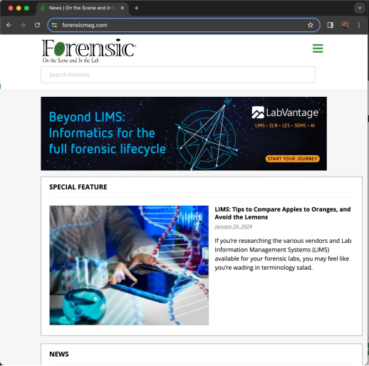
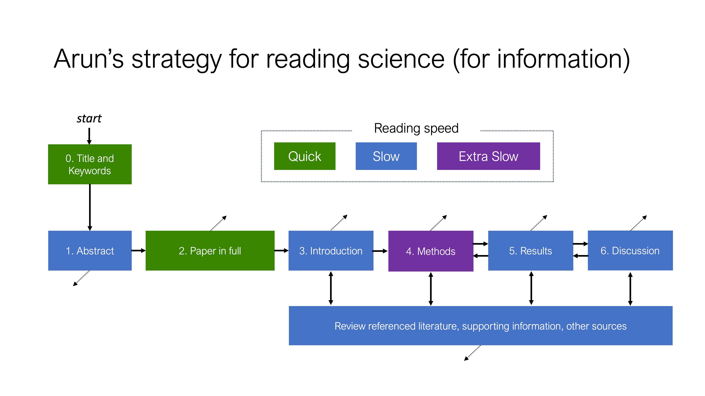
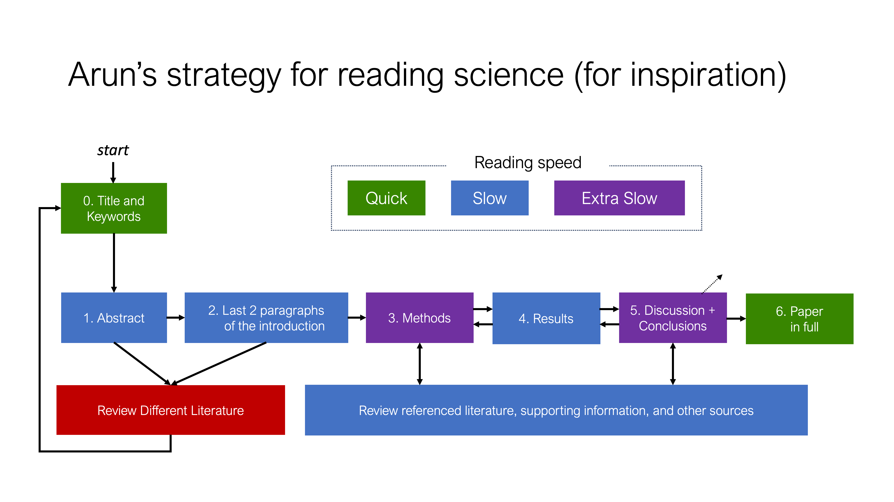
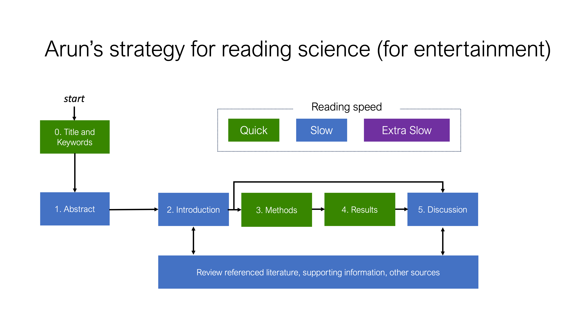

## Why read science?

- **Information:** reading science helps identify and verify knowledge that can be used in professional work and day-day decision-making; valuable skill for anyone   
- **Inspiration:** reading science helps identify and verify *techniques and methods* that can be used to explore new questions; valuable skill for scientists (and aspiring scientists)  
- **Entertainment/wonder:** reading science can provide an additional source of intrigue/curiosity about the world

## Types of publications 

:::: {.columns}
::: {.column width=70% .nonincremental}
- Publication: any form of (written) communication made available for distribution to the public 
- **Scholarly work:** Special interest publication for scholars *in a field*.
    - E.g., thesis/dissertation, journal article, etc. 
    - Benefits: (usually) well-reviewed and trustworthy information
    - Drawbacks: usually written for other experts, can be difficult to read if not primary area of scholarship

:::
::: {.column width=4%}
:::
::: {.column width=25% .align-center}
  
{width="100%}
:::
::::

## Types of publications 

:::: {.columns}
::: {.column width=70% .nonincremental}
- Publication: any form of (written) communication made available for distribution to the public 
- **Popular Source:** *General interest* publication.
    - E.g., newspapers, magazines, books, etc.
    - Benefits: usually written in a very accessible manner, can be a useful introduction to a topic
    - Drawbacks: usually not fact-checked / peer-reviewed, may not contain full citation information for further reading
:::
::: {.column width=4%}
:::
::: {.column width=25% .align-center}
  
{width="100%}
:::
::::

## Types of publications 

:::: {.columns}
::: {.column width=70% .nonincremental}
- Publication: any form of (written) communication made available for distribution to the public 
- **Trade magazines:** *General interest* publication for people *within a specific industry*
    - May contain reports of new research in a field, but also other business of interest to the readership
    - Benefits: Good way to keep up-to-date on an industry
    - Drawbacks: Not all articles are peer-reviewed, can be overly specialized
:::
::: {.column width=4%}
:::
::: {.column width=25% .align-center}
  
{width="100%}

[www.forensicmag.com](https://forensicmag.com){target="_blank" style="font-size: 0.3em;"}

:::
::::

## Types of scholarly works (primary sources)
- **Thesis/Dissertation** - Published as (bound) books by Universities
    - Documents one (or more connected) research studies that is of interest to a field
- **Original Research Paper** - Published in Journals
    - Documents comprehensive research that is expected to *significantly* advance the field.
- **Short Communications / Technical Notes** - Published in Journals
    - Document a technical advancement that may of interest to other researchers or practitioners in a field

## Types of scholarly works (primary sources)
- **Case Reports (Case Studies)** - Published in Journals
    - Documents an unexpected observation/case (or small series of cases) that may be of interest to other researchers or practitioners in a field
- **Letters/Commentaries** - Published in Journals and Trade Magazines
    - Documents an opinion or commentary on a previously published article or topic of interest with the intention of sparking further discussion amoung other researchers or practitioners in a field
- **Reviews** - Published as books or in Journals
    - Documents a summary or review of interest to other researchers or practitioners in a field

## Other types of scholarly works 

- **Conference Paper** - Published in a conference proceedings
    - A description of research or technical development that was presented as part of a scientific conference
- **Pre-print / Manuscript** - "Published" on a pre-print server
    - A *working draft* of an original research paper, technical note, case report, commentary or review that has yet to be formally submitted for publication in archival journal but is made available for public review
    
## On the credibility of scholarly works

- All theses and dissertations should have been defended to an examination committee  
- All scholarly work published in a reputable journal should have been reviewed, at minimum, a journal editor  
- Most scholarly work published in a reputable journal will have been peer-reviewed by 2 or more experts in the field
    - Single-blind - Authors are known but Referees are anonymous
    - Double-blind - Authors and Referees are anonymous to each other
    
    
## On the credibility of scholarly works

- There are still several issues that plague the reliability of scholarly works:
    - Thesis examinations vary significantly
    - Not all journals are reputable--referred to as "predatory" journals among scientists
    - Not all peer-review is effective; there are several well documented challenges with confirmation bias
    
## Guidelines for critically reviewing a paper

- Verify the credibility of the journal (this is getting harder)
    - Is the journal associated with a reputable society?
    - Are the editors well-known (published) in the field?
    - What are the journals "performance metrics"?
        - Impact Factor: Usually listed on a journals main page
        - SJR: [https://www.scimagojr.com/](https://www.scimagojr.com/){target="_blank"}

## Guidelines for critically reviewing a paper

- Verify the credibility of the authors (this can be problematic)
    - Are the authors well-known (published) in the field?
    - Are the authors from reputable institutions?
    - Do the authors have potential competing interests?
    - What are the authors' "performance metrics"?
        - Number of publications
        - Number of citations
        - H-Index

## Guidelines for critically reviewing a paper

- Read the paper carefully!

::: {.notes}
- talk to other people, see if a colleague or friend can read the paper too
- research supervisor
:::

## The anatomy of a research article

- Title
    - Provides a very quick glimpse into the main topic of the paper; sometimes includes the main conclusion of the paper
    - Can have word limits that are imposed by the publisher

## The anatomy of a research article

- Author Information
    - List the authors that prepared the article, including their instition
        - Generally, the first name listed is the "lead" author and wrote the original draft of the paper
    - Provides contact information for the "corresponding" author (usually indicated by a star)--this is the person you should reach out to if you have any questions about the work
    - Note that the email address may no longer be valide; you may need to do some digging to find the author's current address
    
## The anatomy of a research article

- *Graphical Abstract*
    - An image that represents the main idea of the paper
    - Often a flow chart or schematic diagram; can be a photot
    - Image size (and text size) requirements are imposed by the publisher
    
## The anatomy of a research article

- Abstract and Keywords
    - Provides a summary of the main objectives, methods, results and conclusions from the research; may include some background as well
    - Can have word limits that are imposed by the publisher
    - Usually 3-5 keywords that the journal uses to help index the paper
    

## The anatomy of a research article

- Introduction
    - Provides background information that motivates the research study; often a short review of related scientific papers (lots of citations); can include figures and tables
    - Written for a general audience
    - States the research objectives or hypotheses

## The anatomy of a research article

- Theory and Methods / Materials and Methods / Methods
    - Provides details about theory necessary to understand the research design/strategy, and materials and methods necessary to reproduce the research
    - Often includes schematics, diagrams, equations, photos
    - Written for other technical experts; great place to learn about new techniques

## The anatomy of a research article

- Results / Results and Discussion
    - Provides a description and interpretation of the data/findings uncovered in the research
    - Often includes figures (i.e., graphs) and tables to support interpretation

## The anatomy of a research article

- **Discussion** / Discussion and Conclusion
    - Provides a discussion of the results, including
        1. how well do the results address the initial research question
        1. how do the results fit into the context of the field (i.e., how do results from this study compare to other studies)
        1. are their any known limitations to the results
        1. what future work can be done to improve the strength of the results

## The anatomy of a research article

- Discussion/ Discussion and **Conclusion**
    - Restates the main findings from the research study and provides closure to the paper

## The anatomy of a research article

- *Acknowledgements*
    - Shares the names of other people or agencies that supported the work; state if the research was funded by an external body; declare competing interests; copyright statements

## The anatomy of a research article

- References
    - A list of all sources used to conduct the study and prepared the article, as cited in the paper itself
    - There will NEVER be references that are not cited in the paper

## The anatomy of a research article

- *Supplemental Material / Supporting Information*
    - Provides additional information that was essential to conducting the research, but not necessarily essential for communicating the results of the paper
        - e.g., extra figures/results, extra tables, photos, source code, raw data  
    - There should NEVER be supporting information that is not described/mentioned in the paper
        
## The anatomy of a research article
 

:::: {.columns .nonincremental}

::: {.column width=48% .nonincremental}
- Title
- Author Information
- *Graphical Abstract*
- Abstract and Keywords
- Introduction
- Methods
:::
::: {.column width=4%}
:::
::: {.column width=48% .nonincremental}
- Results
- Discussion
- Conclusions
- *Acknowledgements*
- References
- *Supporting Information*
:::
::::

## 

## 

## 

## Other quick pointers

- Papers do not live in isolation; you may need to read several papers to "understand" one paper   
- To get better at reading science, you have to do it consistently
    - The FIU Research Forensic Library: [www.forensiclibrary.org](https://www.forensiclibrary.org){target="_blank"}  
- If you find a paper that you like, read more papers (i) by that author, (ii) from that institution, (iii) in that field ... 
    - Re-read the papers that you like. Think about why you like the papers. Is it the topic? The author? etc. 
    
## On mathematics

- Mathematics is a commonly employed language in scientific/technical writing
    - affords precision that is not really possible in traditional languages  
- Many people have "math anxiety"; this becomes a problem when trying to read science  

1. Think of math as a language; you don't have to have "native proficiency" to use a language  
2. Use software to help you "translate" mathematics

## {.center}

::: {.text-center}
Good luck with content quiz 2! (Due September 24 at 11:59 PM)
:::
