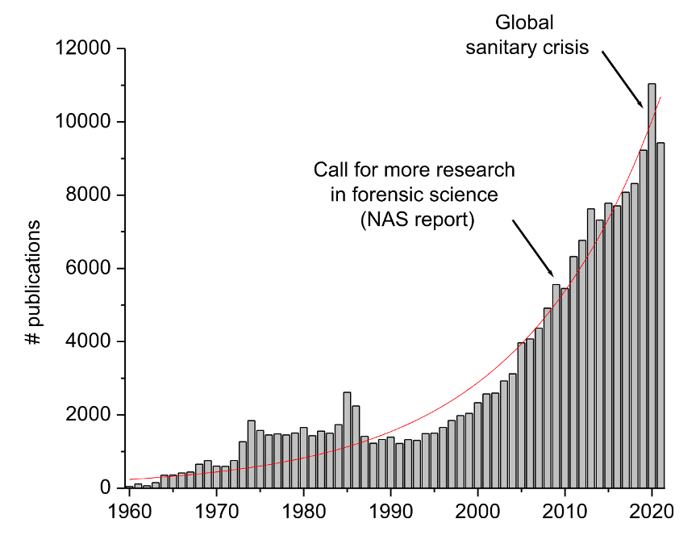

## The publishing industry

- Research articles are often published in "journals"
    - E.g., Journal of Forensic Science, Forensic Science International
    - Journal handles scientific process (e.g., peer-review process)  
    
- Journals are published by "publishers"
    - E.g., Wiley, Elsevier, Canadian Science Publishers
    - Publisher handles the business process (e.g., printing, web-hosting, marketing, etc.)  

::: {.notes}

:::

## Access to articles

- Some articles are behind a pay-wall (subscription system)
    - Reader needs to pay for the specific article they way to read **OR** 
    - Reader needs to belong to an institution that pays for a subscription   

- Some articles are open to the public (open access)
    - Author needs to pay for their article to be published **OR**
    - Author needs to belong to an institution that pays for authoring

## The "forensic science" literature {.nonincremental}

- It has been reported that there are over 183,000 scientific papers with the word "forensic" in the title, keywords, abstract or journal name  
- And the rate of publication has grown exponentially  
- See [Weyerman et al. (2023)](https://doi.org/10.1016/j.forsciint.2023.111592){target="_blank"}

# {.center}
{fig-align="center"}

## What is a literature review?

- A **literature review (v)** is the process of searching for information on a topic from published literature. Several ways to conduct a literature review.
    - Usually the first step of a formal research project
    - Also useful for students, managers, policy-makers trying to better understand the current state of a field   
    
- A **literature review (n)** is a document that summarizes the results of performing a literature review. Several ways to prepare a literature review.

## Types of literature reviews (v)
  

- **Scoping review:** a search to assess the nature and potential size of the literature on a topic of interest 

    - Can be done fairly quickly
    - Example output: number of papers, types of papers, recency of papers, etc. 

## Types of literature reviews (v)
  

- **Systematic Review:** a comprehensive search and appraisal of all literature on a topic of interest

    - Requires design and documentation, often takes a lot of time
    - Output is “insight”; e.g., gaps in the literature

## Types of literature reviews (v)
  

- **Rapid review:** a quick search and appraisal of literature on a topic of interest

    - Requires some considerations, but can be done fairly quickly

## Types of literature reviews (n)

- **Overview:** a broad overview of the published literature on a general topic; appropriate for introducing a new area of research  

- **Narrative:** a summary of recently published peer-reviewed literature for a topic of interest; often presented chronologically  

- **Critical:** a critical evaluation of recently published peer-reviewed literature for a topic of interest; often presented chronologically but sometimes topically

## Types of literature reviews (n/v)

- **Integrative:** evaluates and presents published literature that contain both experimental results and non-experimental discussions   

- **Mapping Review/Systematic Map:** evaluates and presents published literature by sub-topics; can help identify gaps in the literature  

## Types of literature reviews (n/v)

- **Qualitative Systematic Review/Qualitative Evidence Analysis:** synthesizes and presents qualitative results from multiple research articles to try and capture deeper insights  

- **Meta-analysis:** synthesizes (and analyzes) and presents quantitative results from multiple research articles (and supplemental data) to try and capture deeper insights

## Practical literature reviews for students
  
**Strategy 1:** Ask for recommendation from a subject matter expert

## Practical literature reviews for students
  
**Strategy 2:** Conduct a rapid literature review using a literature database and keywords/filters; read papers that you think are most relevant (skill)

## Practical literature reviews for students
  
**Strategy 3:** “Bi-directional boot-strap reading”

  - Find an initial “seed” paper (e.g., from a SME)
  - Identify the most important papers cited by the seed paper, create a new seed
  - Identify papers that have cited the seed paper, create a new seed  

## Practical literature reviews for students
  
**Strategy 4:** “Bi-direction boot strap reading with stochasticity”

  - Extend strategy 3 by occasionally identifying new seed with keyword searches

## Example Literature Database

- General purpose databases:
    - [Google scholar](https://scholar.google.ca/intl/en/scholar/about.html){target="_blank"}
    - [PubMed](https://pubmed.ncbi.nlm.nih.gov/about/){target="_blank"}
    - [EBSCO](https://about.ebsco.com/about/mission){target="_blank"}
    - [JSTOR](https://about.jstor.org/){target="_blank"}   
- Field specific databases: [https://guides.lib.trentu.ca/az/databases](https://guides.lib.trentu.ca/az/databases){target="_blank"}
    - [https://forensiclibrary.org/home](https://forensiclibrary.org/home){target="_blank"}  (they have a mailing list with daily updates)

## Lexical vs Semantic Searches

- Traditional literature databases (e.g., Google Scholar) are indexed by “keywords”; so we use lexical searches to identify papers
    - E.g., “ cigarettes + students + Peterborough + Ontario ”  

- With AI tools, we can start doing semantic searches
    - E.g., “ how many students smoke cigarettes in Peterborough Ontario?”  

- Example AI-based tools for literature reviews
    - [Consenus](https://consensus.app/){target="_blank"}
    - [SciSpace](https://scispace.com){target="_blank"}
    - [ResearchRabbit](https://app.researchrabbit.ai/){target="_blank"}
    
## A few more thoughts

- the mathematics underlying AI tools is complicated, susceptible to chaos  
- Read the paper carefully, **verify** that the AI "insights" are true and relevant  
- Remember that when you submit work with your name on it, YOU are responsible for the validity and truth of what you've submitted  
- Identifying good papers that you can learn from is an essential activity for scientists; use AI tools if they can help you

## {.center}

::: {.text-center}
Good luck with content quiz 3! (Due October 1st at 11:59 PM)
:::
