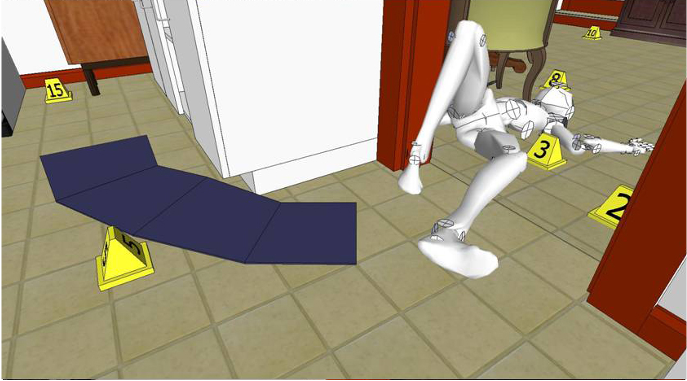
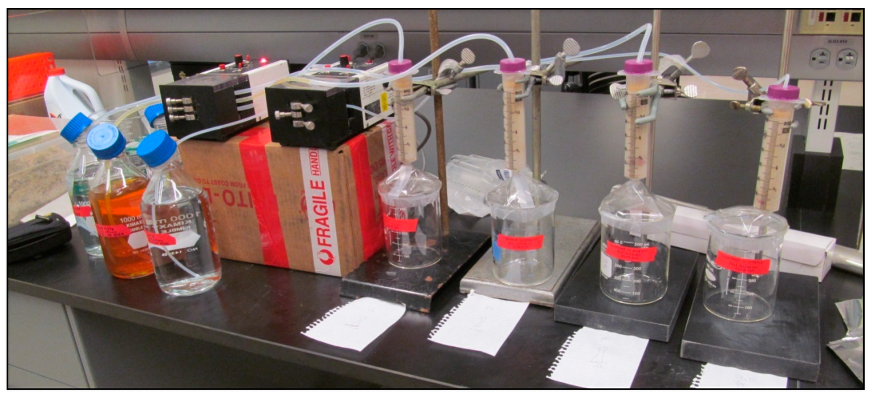
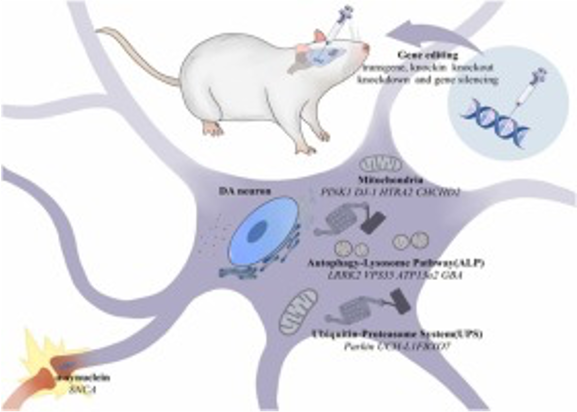
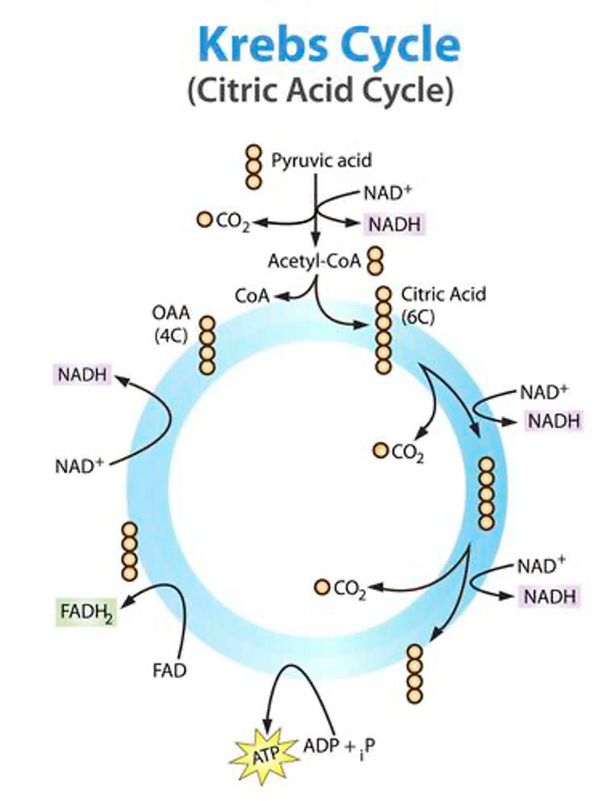

## 

::: {style="background-color: #E0E6ED;font-size: 1em; padding: 5px 25px; border-radius: 5px; border-left: 5px solid #006dae;"}
**Scenario:** There are two new brands of fingerprinting powder available for purchase. They both cost the same, and both make claims that they are able to adhere to "weak" prints. Which one should you use?
:::

  - We could see if there is any published literature on either powder? 
  - We could see if there is any other publicly available information about either powder?   
  
  - In cases where there are no available answers (or you question the credibility of the available answers), we have to figure out the answer for ourselves
  

## What is an experiment?

- Experiments involve varying **controllable factors** such that we can observe the effect on a **measurable response**
  - Can run experiments in many contexts: laboratory experiments, numerical experiments, social experiments   
  
- In an experimental study, factors are directly controlled by the experimenter
- In an observational study, factors are not directly controlled by the observer
- Another word for factor is **independent variable**; another word for response is **dependent variable**

## The components of an experiment

1. Question of interest
1. Response variables or dependent variables
1. Treatment factors or factors or independent variables
    - Levels (settings, options)
1. Experimental units
1. Structure
1. Design

## The components of an experiment

- **Question of interest**: these questions (or objectives) are what motivate us to do experiments. For example:  
  
  - Does shot gun brand affect pellet scatter pattern?
  - Is the number of glass fragments found on the ground affected by the velocity, shape and hardness of the bullet fired to break the window?
  - Does the drinking container/beverage combination affect the amount of DNA left on the container?
  
## The components of an experiment

- **Response variables**: the variables being measured to address the question of interest (dependent variables)
  - An ideal response variable will have a strong relationship to the question of interest, low natural variability, be sensitive to changes in the treatment, and not be expensive to measure  

  - Does the shot gun brand affect [the pellet scatter pattern]{style="color: blue;"}? 

  - Is the [number of glass fragments]{style="color: blue;"} found on the ground affected by the velocity, shape and hardness of the bullet fired to break the window?
  
  - Does the drinking container/beverage combination affect [the amount of DNA]{style="color: blue;"} left on the container?

## The components of an experiment

- **Treatment Factors:** the variables (or inputs) that can be directly varied by the experimenter (independent variables); sometimes referred to as treatments or factors

  - Does [shot gun brand]{style="color: blue;"} affect pellet scatter pattern?
  - Is the number of glass fragments found on the ground affected by [the velocity, shape and hardness of the bullet]{style="color: blue;"} fired to break the window?
  - Does [the drinking container/beverage combination]{style="color: blue;"} affect the amount of DNA left on the container?

- Each factor may have levels

## The components of an experiment

- **Experimental units:** the objects or subjects to which the treatments (changes in factor level, inputs, etc.) are applied, and from which measurements are made  

  - Does shot gun brand affect pellet scatter pattern? [[Cardboard target]{style="color: blue;"}]{.fragment}
  - Is the number of glass fragments found on the ground affected by the velocity, shape and hardness of the bullet fired to break the window? [[Pane of glass]{style="color: blue;"}]{.fragment}
  - Does the drinking container/beverage combination affect the amount of DNA left on the container? [[Participant (a DNA contributor); container]{style="color: blue;"}]{.fragment}

## The components of an experiment

- **Structure (in experimental units):** experimental units will likely not be homogenous, which could affect the results of the experiment  

- If consider well, this natural strucuture in experimental units can be leveraged to design more efficient experiments--reducing the number of experimental units needed and creating more accurate comparisons

## The components of an experiment

- **Design (assignment of treatments to experimental units):** a strategy for assigning combinations of the level of the treatment factors (treatments) to address the question of interest  

- **Factorial design**--evaluating every combination of every level of every factor--is the most intellectually straightforward design, but *may not be feasible* in many instances

## The *basic principles* of experimental design

1. **Replication:** each treatment should be used more than once in the experiment, otherwise we cannot properly assess variability (judge random variation); if possible, more replication is **always** preferable  
2. **Blocking:** exploiting an structure that exists in the experimental units; if possible, units should be divided into "blocks" where units within a block are more similar than units not in the same block  
3. **Randomization:** each treatment should be allocated to randomly selected experimental units to (1) prevent systematic or unconscious bias, and (2) ensure "independence" of observations
  
## Common Experimental Design strategies

- A **completely randomized design (CRD)** is a design where the experimental units are considered homogenous (i.e., there is no block structure OR every unit is withint its own block). Treatments are applied to randomly selected experimental units.  
- A **randomized complete block design (RCBD)** is a design that takes simple block structure into account, grouping experimental units into blocks so that there is less variability among members of the same block

## Common Experimental Design strategies

- A **balanced incomplete block design (BIBD)** is a design to use when the number of units per block is less than the number of possible treatments. The compromise is to use a subset of the treatments in each block, such that (1) each treatment is replicate and equal number of times across all blocks, and (2) each pair of treatments occur together in the same block equally

## Example 1: Shotguns

::: {style="background-color: #E0E6ED;font-size: 0.8em; padding: 5px 25px; border-radius: 5px; border-left: 5px solid #006dae;"}
**Scenario:** We have two different guns (Stevens and Remington). We want to know if there is a difference in pellet scatter patters due to brands. We have 60 cardboard targets (same brand, same batch) and can take shots from 5 different distances (10m, 20m, 30m, 40m, 50m). How *might* we proceed?
:::

:::{style="font-size: 0.9em;"}
1. **Question**: Is there a difference in scatter pattern between gun brands?
2. **Response variable:** scatter pattern (shape, max distance, some metric)
3. **Factors:** Gun (2), distance (5)
4. **Experimental units**: cardboard targets
5. **Structure**: none
6. **Design**: Completely randomized design (2 guns x 5 spots x 6 replicates)
:::

## Example 1: Shotguns

::::{.columns}

:::{.column width="60%" .nonincremental}
**Steps to take**

1. Determine all possible treatments (including replicates).
2. Randomly assign each treatment to an experimental unit
3. Conduct experiment and collect results (data)
4. Analyze results (data)
:::

:::{.column width="40%"}
:::{style="font-size:0.8em"}
| Target | Gun | Range | 
|--:|:---------|--:|
| 1 | Stevens |   10 |
| 2 | Remington | 30 | 
| 3 | Stevens |   20 |
| 4 | Stevens | 20 |
| 5 | Stevens | 30 |
| 6 | Remington | 40 |
|...|...|...|
|60|Remington|10| 
:::
:::

::::

## Example 2: Glass

::: {style="background-color: #E0E6ED;font-size: 0.8em; padding: 5px 25px; border-radius: 5px; border-left: 5px solid #006dae;"}
**Scenario:** We have 150 pieces of glass. We want to determine whether annealing (heating and cooling) affects the measured refractive index. How *might* we proceed?
:::

:::{style="font-size: 0.9em;"}
1. **Question**: Does annealing affect the measured refractive index?
2. **Response variable:** refractive index
3. **Factors:** annealing status (yes or no)
4. **Experimental units**: 150 pieces of glass
5. **Structure**: each piece of glass can be measured pre- and post-annealing
6. **Design**: Randomized complete block design (150 x 2)
:::

## Example 2: Glass

::::{.columns}

:::{.column width="60%" .nonincremental}
**Steps to take**

1. Label each glass piece (1 to 150)
2. Randomly select pieces to measure pre-annealing
3. Randomly select pieces to measure post-annealing
4. Analyze results 
:::

:::{.column width="40%"}
:::{style="font-size:0.8em"}
| Target | Fragment # | Anneal Status | 
|--:|---------:|--:|
| 1 | 10 |   pre |
| 2 | 23 | pre | 
| ... | ... |   ...|
| 150 | 13 | pre |
| 151 | 17 | post|
| 152 | 131 | post |
|...|...|...|
|300|3|post| 
:::
:::

::::

## Example 3: Clinical trial

::: {style="background-color: #E0E6ED;font-size: 0.8em; padding: 5px 25px; border-radius: 5px; border-left: 5px solid #006dae;"}
**Scenario:** We have 6 volunteers (3 students and 3 professors) to test 4 different drinks (A, B, C, D). We want to see if any of these drinks affects heart rate. We can run, at most, 3 trials. How *might* we proceed?
:::

:::{style="font-size: 0.9em;"}
1. **Question**: Does drink affect measured heart rate?
2. **Response variable:** heart rate
3. **Factors:** drink type
4. **Experimental units**: 6 participants
5. **Structure**: can block the experimental units by academic position
6. **Design**: A balanced incomplete block design
:::

## Example 3: Clinical Trial

:::{style="font-size:0.8em"}
| Participant | Position | Trial 1 | Trial 2 | Trial 3 
|--|:---------|--|---|---|
| 1 | Student |  A  | B | A |
| 2 | Student | B | C | C/B | 
| 3 | Student | C | D | D |
| 4 | Professor | A | B | A |
| 5 | Professor | B| C | C/B |
| 6 | Professor | C | D | D |
:::

 

::: {style="background-color: #E0E6ED;font-size: 0.7em; padding: 5px 25px; border-radius: 5px; border-left: 5px solid #006dae;"}
A **balanced incomplete block design (BIBD)** is a design to use when the number of units per block is less than the number of possible treatments. The compromise is to use a subset of the treatments in each block, such that (1) each treatment is replicated an equal number of times across all blocks, and (2) each pair of treatments occur together in the same block equally.
:::

## Models

- **Abstraction:** the process of removing characteristics from a system being studied *in order to* to better understand essential qualities   

- **Model**: A simplified represetnation of a system being studied; the results of abstraction   

- If a model accurately describes the essential qualities of the system being studied, analysis of the model will provide **useful insights** about the underlying system

## Physical Models

::::{.columns}

:::{.column width="50%" .nonincremental}
- **Physical Model:** Constructed using physical (or virtual representations of physical) objects  
- Key Forensic Science Uses:
  - Crime scene reconstruction
:::

:::{.column width="50%"}
{fig-align="center"}

[Example using SketchUp](https://sketchup.trimble.com/en/blog/article/sketchup-crime-scene-reconstruction){target="_blank"}

:::

::::

## Laboratory Models

::::{.columns}

:::{.column width="50%" .nonincremental}
- **Laboratory Model:** Constructed using laboratory equipement like beakers, pumps, tubes  
- Key Forensic Science Uses:
  - Parameter estimation in environmental toxicology
:::

:::{.column width="50%"}
{fig-align="center"}

[Image from "Ullman et al. (2023)"](https://doi.org/10.3390/min13050596){target="_blank"}

:::

::::

## Animal Models

::::{.columns}

:::{.column width="50%" .nonincremental}
- **Animal Models:** Using animals (or animal material) as proxies for understanding other animals (including humans)  
- Key Forensic Science Uses:
  - Toxicology
  - Decomposition studies
:::

:::{.column width="50%"}
{fig-align="center"}

[Image from "Zhang et al. (2022)"](https://doi.org/10.1016/j.biopha.2022.113768){target="_blank"}

:::

::::

## Mathematical and Computational Models

::::{.columns}

:::{.column width="50%" .nonincremental}
- **Mathematical Models:** Constructed using mathematical objects like variables, distributions, functions, equations, etc.  
- Key Forensic Science Uses:
  - Surveillance
  - Intelligence
  - Optimization
:::

:::{.column width="50%"}
{fig-align="center"}

[Excerpt from "Calatayud et al. (2023)"](https://doi.org/10.1002/mma.9064){target="_blank"}

:::

::::

## Conceptual Models

::::{.columns}

:::{.column width="50%" .nonincremental}
- **Conceptual Models:** Constructed using design objects like schematics, flow charts, etc.  
- Key Forensic Science Uses:
  - Education and explanation
:::

:::{.column width="50%"}
{width="50%"}

[Excerpt from LibreTexts "Introductory Biology"](https://bio.libretexts.org/Bookshelves/Introductory_and_General_Biology/Introductory_Biology_(CK-12)/02%3A_Cell_Biology/2.28%3A_Krebs_Cycle
){target="_blank"}

:::

::::

## A final thought on models 

    

[["All models are wrong, but some are useful" -- George E.P. Box](https://en.wikipedia.org/wiki/All_models_are_wrong){target="_blank"}]{.fragment}

## {.center}

::: {.text-center}
Good luck with content quizzes 4a and 4b! (Due October 15th at 11:59 PM)
:::